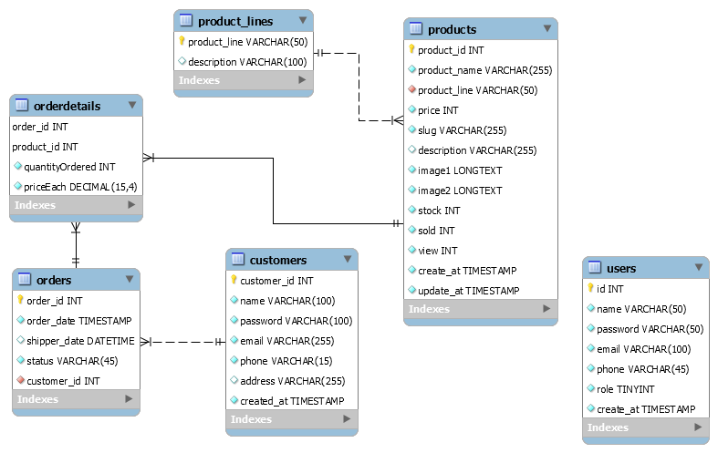

# CaseStudyModul_2
Tên Đề tài: Trang quàn lí bán hàng
Bao gồm các trang: quản trị và trang danh cho người dùng.
-Trang dashboard:
  +Thêm sửa xóa sản phẩm.
  +Thông tin khách hàng.
  +Thêm sửa xóa trạng thái của các order.
  
  
-Trang dành cho người dùng.
  +Trang chủ:
    ++Navbar.
    ++Sản phẩm mới.
    ++Sản phẩmlượt xem nhiều nhất.
    ++Sản phẩm bán chạy.
    ++Footer
  +Trang sản phẩm theo từng danh mục riêng.
    ++Navbar
    ++Sản phẩm của danh mục đó.
    ++Footer.
  +Trang sản phẩm chi tiết.
   ++Navbar.
   ++Ảnh sản phẩm.
   ++Chi tiết sản phẩm.
   ++Footer.
  +Trang giỏ hàng.
    ++Navbar.
    ++Thông tin các sản phẩm trong giỏ hàng.
    ++Footer.
  +Trang thanh toán.
    ++Navbar.
    ++Thông tin khách hàng.
    ++Thông tin giỏ hàng.
    ++Footer.
  +Trang đăng ký, đăng nhập.  

..
